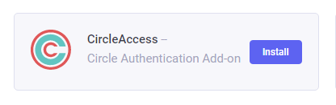

# Circle Access
Circle Access add-on provides Credential-less Authentication  

# Circle Access ExpressionEngine Add-On
All tests were performed with ExpressionEngine version 6.2.5

## Installation

### 1) Download the zip file

- Download the file ```CircleAccess.zip``` and unzip it to the root folder of ExpressionEngine. Below is the structure of the Circle Access add-on:


### 2) Install the Add-On

In the ExpressionEngine administration console, select ```Add-Ons``` from the left menu and click the Circle Access ```Install``` button.




### 3) Configuring the Add-On

For the Add-On configuration, first, we have to create a New Application on Circle Console (https://console.gocircle.ai/dashboard/).

- Click on the ```Add New``` button. On the field ```Login Return URL``` inform the following URL: ```https://your_domain/circle_access/callback.php``` 


After saving the Application, a screen with the application keys will be displayed. Open the file ```circleAccess/includes/config.php``` and inform the respective keys (APP_KEY, READ_KEY and WRITE_KEY).
You can also set other parameters such as NEW_MEMBER_DEFAULT_ROLE, REDIRECT_URL, etc.


Optionally, the Circle Access login button can be added to ExpressionEngine default admin login page.
To do this, edit the ```login.php``` file located at ```system/ee/ExpressionEngine/View/account/login.php``` and add the following code to the end of the file: (outside the form)

 ```
<?php
  include getcwd().'/circle_access/includes/loginButton.php';
?>
 ```

- Query the table ```actions``` (exp_actions) and get the ```action_id``` of the class ```CircleAccess```
- Open the file ```circleAccess/includes/config.php``` and set the constant ```CIRCLE_ACCESS_ACT``` with the retrieved action_id.


